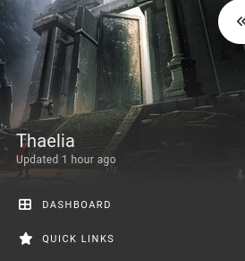

# Campaigns

A campaign, also known as a **world** or a **universe**, is the way data is stored in Kanka. Everything belongs to a campaign.

## Creating a campaign

To create a campaign, open the campaign switcher and click on **new campaign**.


## Campaign settings

The following aims to detail each field available when creating or editing a campaign. To access this interface, click on **World** and **Edit campaign**.

### Entry

The first tab is the **entry** tab, containing the most basic fields.

#### Name

A campaign needs a world, containing at least 4 characters. Campaign names aren't unique (we wouldn't want a single _Tal'Dorei_ now would we?). A campaign's name can be changed at any time.

#### Description

A short (or long, we don't judge!) description of your campaign. A preview of this displays on the campaign's dashboard, and the full text is available when clicking on **World** or **Campaign** in the sidebar. 

``` {admonition} Friendly tip
This field can contain mentions to entities of the campaign!
```

#### Sidebar image

Select an image from your device or from a url to upload as the campaign's image. This image is visible in the campaign switcher and on the top of the sidebar.




### Sharing

The second tab focuses on sharing the campaign's content with people who aren't in the campaign. You can find out more about this [here](/features/campaigns/public-campaigns)

### Interface

This tab controls some basic look and feel of the campaign.


#### Campaign theme

Rather than displaying the campaign in the user viewing it's preferred theme, you can force the campaign to appear in a specific theme.

#### Campaign's member list

Control who can see the campaign's member list. This list is available in **World** and **Members**.

#### Entity history logs

Control who can see individual entity's change logs.

#### Tooltip - Entity's image

By default, tooltips that appear when hovering an entity link don't display that entity's image. This can be changed with this option.

#### Default entity's connections interface 

When clicking on an entity's **relations** subpage, select what displays. On boosted campaigns, the default is to show the **relation explorer**.

#### Default relations explorer mode 

When opening an entity's **relation explorer**, control which mode is opened by default.

#### Default lists layout

Select if nested entities display in a user's preferred layout, or if you want to force nested lists.

#### New post default collapsed value 

Control if newly created [posts](/features/posts) are collapsed by default.

### Permissions

This tab allows you to set the default privacy and visibility settings of new elements created in the campaign.

#### Default new entity privacy 

When creating a new entity as an admin, select the default privacy setting of the new entity.

#### Related Elements Visibility 

When creating a new post, quest element, inventory item, or any other object with a **visibility** field, define which value is selected by default.

#### Default character personality visibility

When creating a new character as an admin, select the default privacy setting for its personality traits.


### Dashboards

The last tab controls info displayed on the dashboard's [campaign header widget](/guides/dashboard#ampaign-header).